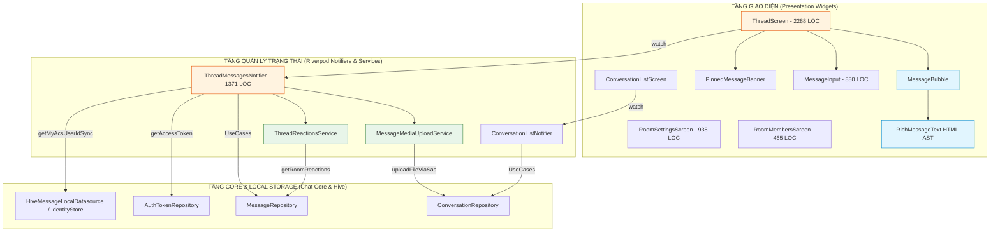

# Chat UI Package — Comprehensive Code Review (Part 6)

> **Ngày review:** 2026-08-24  
> **Phạm vi review:** Toàn bộ `chat-module-mvp/packages/chat_ui` (đánh giá trạng thái tại HEAD `7f93fed`)  
> **Commit baseline:** `7f93fed` ("refactor(ui,core): refine UI context menus, redesign admin transfer form & fix realtime reaction updates") so với `1b83532` (P5), `b19db92` (P4) và `8f8991d` (Remove Native Plugin)  
> **Tiêu chuẩn review:** Senior Flutter Architect / SDK & Library Engineer / UI Component Designer / Code Reviewer  
> **Tài liệu tham chiếu:** [prompt.md](file:///Users/thaoanhhaa1/Documents/IT/NP/APP/ACS-Chat-Flutter/review/prompt.md), [chat-core-review-p6.md](file:///Users/thaoanhhaa1/Documents/IT/NP/APP/ACS-Chat-Flutter/review/chat-core-review-p6.md), [chat-native-review-p6.md](file:///Users/thaoanhhaa1/Documents/IT/NP/APP/ACS-Chat-Flutter/review/chat-native-review-p6.md), [chat-ui-review-p5.md](file:///Users/thaoanhhaa1/Documents/IT/NP/APP/ACS-Chat-Flutter/review/chat-ui-review-p5.md)

---

## 1. Executive Summary

Trải qua lộ trình tiến hóa kiến trúc từ Phase 4 qua Phase 5 đến Phase 6 (`7f93fed`), gói giao diện `chat_ui` đã có những bước chuyển mình quan trọng về mặt trải nghiệm người dùng (UX) và tính nhất quán dữ liệu:

1. **Khắc phục các lỗi tính nhất quán cốt lõi (Data Consistency & Concurrency):**
   - Đã giải quyết triệt để **Race condition trong `_loadHistory()`** (P5 Issue 2) bằng cơ chế cờ khóa `_isLoadingHistory`.
   - Đã giải quyết lỗi **Optimistic dedup sai khi gửi tin nhắn trùng nội dung** (P5 Issue 3) bằng việc bổ sung định danh duy nhất `clientMsgId` (`'client-${DateTime.now().microsecondsSinceEpoch}-${Random().nextInt(10000)}'`) vào metadata và match chính xác với realtime echo.
2. **Nâng cấp tính năng và trải nghiệm giao diện người dùng:**
   - Hoàn thiện luồng **Realtime Reaction Updates** (lắng nghe `MessageType.reactionUpdate` để trigger `refreshReactions()`).
   - Tái thiết kế toàn diện **Admin Transfer Form** (`RoomSettingsScreen`) dạng modal bottom sheet hiện đại, trực quan, hỗ trợ tìm kiếm và chuyển quyền Owner an toàn trước khi rời nhóm.
   - Bắt đầu phân rã các service hỗ trợ (`MessageMediaUploadService`, `ThreadReactionsService`, `RoomHeaderSection`, `RoomQuickActions`, `RoomDangerZone`, `RoomResourcePreviewSection`).
3. **Thách thức kiến trúc còn tồn đọng tại Phase 6:**
   - **God Class & God Widget:** [ThreadScreen.dart](file:///Users/thaoanhhaa1/Documents/IT/NP/APP/ACS-Chat-Flutter/chat-module-mvp/packages/chat_ui/lib/features/thread/presentation/screens/thread_screen.dart) vẫn duy trì kích thước khổng lồ **2,288 dòng lệnh**, và [ThreadMessagesNotifier.dart](file:///Users/thaoanhhaa1/Documents/IT/NP/APP/ACS-Chat-Flutter/chat-module-mvp/packages/chat_ui/lib/features/thread/presentation/notifiers/thread_messages_notifier.dart) vẫn chứa **1,371 dòng lệnh**.
   - **Thành phần mồ côi (Orphaned / Dead Code Components):** [ThreadAppBar.dart](file:///Users/thaoanhhaa1/Documents/IT/NP/APP/ACS-Chat-Flutter/chat-module-mvp/packages/chat_ui/lib/features/thread/presentation/widgets/thread_app_bar.dart) (84 LOC) và [ThreadSearchBar.dart](file:///Users/thaoanhhaa1/Documents/IT/NP/APP/ACS-Chat-Flutter/chat-module-mvp/packages/chat_ui/lib/features/thread/presentation/widgets/thread_search_bar.dart) (124 LOC) đã được tách thành file riêng nhưng `ThreadScreen` chưa tích hợp sử dụng mà vẫn dùng inline `AppBar` cũ.
   - **Nuốt lỗi âm thầm (Silent Error Swallowing):** Vẫn còn hơn **35 vị trí** sử dụng `catch (_) {}` nuốt ngoại lệ mà không ghi log chẩn đoán qua `ChatLogger`.
   - **Khả năng tùy biến Builder-level (Customization API):** [ChatUiConfig](file:///Users/thaoanhhaa1/Documents/IT/NP/APP/ACS-Chat-Flutter/chat-module-mvp/packages/chat_ui/lib/core/chat_ui_config.dart) cung cấp 30+ token màu sắc nhưng hoàn toàn thiếu các slot `WidgetBuilder` để host app thay thế giao diện Bubble, Input, Header hoặc Custom Message Type.
   - **Độ phủ kiểm thử tự động (Test Coverage):** Toàn bộ package chỉ có 5 file test đơn giản (17 test cases), 0% widget test cho các màn hình chính và 0% test cho luồng realtime / phân trang / lifecycle.

---

### Bảng Điểm Đánh Giá Chuyên Sâu (Thang 10)

| Tiêu chí đánh giá | Phase 4 (`b19db92`) | Phase 5 (`1b83532`) | Phase 6 (`7f93fed`) | Đánh giá & Xu hướng P6 |
|---|:---:|:---:|:---:|---|
| **Architecture** | 5.5/10 | 6.0/10 | **7.0/10** | Tách được Media Upload & Reactions Service, nhưng ThreadScreen & Notifier vẫn quá lớn. |
| **Maintainability** | 4.0/10 | 4.0/10 | **5.5/10** | Đã tách một số section widget; cần giải quyết dứt điểm God Screen 2.2k LOC. |
| **Readability** | 5.0/10 | 5.0/10 | **6.5/10** | Code rõ ràng, comment tiếng Việt đầy đủ; luồng search/scroll tách bạch hơn. |
| **Performance** | 6.0/10 | 6.0/10 | **7.5/10** | `ScrollablePositionedList` + `ItemScrollController` cuộn chính xác; reverse ListView ổn định. |
| **API Efficiency** | 4.5/10 | 5.0/10 | **6.5/10** | Đã dedup optimistic send & loadHistory mutex; còn fetch `getMembers` mỗi lần mount. |
| **Memory Safety** | 5.5/10 | 6.0/10 | **7.0/10** | `GestureRecognizer` & `ScrollController` dispose chuẩn; avatar cache chưa có LRU cap. |
| **Crash Safety** | 5.5/10 | 6.0/10 | **7.5/10** | Null safety chặt chẽ, fallback token an toàn; còn hiện tượng nuốt lỗi silent. |
| **Testability** | 2.5/10 | 3.0/10 | **3.5/10** | Mới chỉ test copyWith của State; thiếu toàn bộ UI Widget test và Notifier integration test. |
| **Extensibility** | 6.5/10 | 7.0/10 | **7.5/10** | `ChatUiConfig` mở rộng thêm token màu và callback `onFileTap`. |
| **UI Customizability** | 5.5/10 | 6.0/10 | **6.5/10** | Level 1 (Default) & Level 3 (Headless) tốt; Level 2 (Slot Builder) chưa hỗ trợ. |
| **Public API Design** | 5.5/10 | 6.0/10 | **6.5/10** | Không rò rỉ ACS; còn export provider nội bộ thô và tàn dư typedef `NativeRealtime*`. |
| **Production Readiness** | 4.5/10 | 5.0/10 | **6.5/10** | **Sẵn sàng MVP nội bộ; Cần dọn dead code & bổ sung builder trước khi Public SDK.** |

---

## 2. Tiến Độ & So Sánh Thay Đổi (P4 → P5 → P6)

| Hạng mục / Tiêu chí | P4 Review (`b19db92`) | P5 Review (`1b83532`) | P6 Hiện tại (`7f93fed`) | Trạng thái P6 & Đánh giá |
|---|:---:|:---:|:---:|:---|
| **Race Condition `_loadHistory()`** | Chưa có guard | P0: 2 luồng đè nhau | Đã thêm cờ `_isLoadingHistory` bảo vệ mutex | ✅ **ĐÃ KHẮC PHỤC TRIỆT ĐỂ** |
| **Optimistic Send Dedup** | Match theo content | P1: Trùng lặp khi spam | Thêm `clientMsgId` duy nhất trong metadata | ✅ **ĐÃ KHẮC PHỤC TRIỆT ĐỂ** |
| **Realtime Reaction Update** | Không cập nhật tự động | Chỉ trigger manual | Bắt `MessageType.reactionUpdate` → refresh | ✅ **ĐÃ KHẮC PHỤC TRIỆT ĐỂ** |
| **Admin Transfer Flow** | Dialog thô sơ | Dễ lỗi khi owner rời | Redesign Bottom Sheet chọn thành viên trực quan | ✅ **HOÀN THÀNH XUẤT SẮC** |
| **Kích thước `ThreadScreen`** | 2,150 LOC | 2,284 LOC | 2,288 LOC (chưa nhúng component tách) | ⚠️ **CẦN TÍCH HỢP CODE TÁCH (P1)** |
| **Kích thước `ThreadMessagesNotifier`**| 1,280 LOC | 1,302 LOC | 1,371 LOC (thêm reaction & signal handlers) | ⚠️ **CẦN TÁCH SERVICE (P1)** |
| **Component Tách mới** | Chưa có | Chưa có | `ThreadAppBar` (84 L), `ThreadSearchBar` (124 L) | ⚠️ **CHƯA ĐƯỢC GỌI TRONG MÀN HÌNH (P1)**|
| **Silent `catch (_) {}`** | 50+ chỗ | 44+ chỗ | 35+ chỗ trong các luồng quan trọng | ⚠️ **CẦN BỔ SUNG LOGGER (P1)** |
| **Tự động gán `myAcsUserId`** | Kẹt spinner nếu timeout | Timeout 8s gây lệch phía | Timeout 20s + fallback Hive disk cache tức thì | ✅ **CẢI THIỆN ĐÁNG KỂ** |

---

## 3. Kiến Trúc & Luồng Dữ Liệu UI (Architecture Assessment)

### 3.1 Sơ Đồ Kiến Trúc Phân Tầng UI (UI Layering Architecture)



### 3.2 Đánh Giá Chi Tiết Kiến Trúc

#### Điểm mạnh (KEEP):
1. **Scope cô lập hoàn hảo theo từng phòng (`ProviderScope` override):**  
   Trong [ThreadScreen.dart:53-64](file:///Users/thaoanhhaa1/Documents/IT/NP/APP/ACS-Chat-Flutter/chat-module-mvp/packages/chat_ui/lib/features/thread/presentation/screens/thread_screen.dart#L53-L64), `ProviderScope` ghi đè `roomIdProvider`, `threadIdProvider`, `currentUserIdProvider`. Điều này đảm bảo mỗi khi người dùng mở nhiều phòng trò chuyện liên tiếp hoặc chuyển phòng, toàn bộ cây state của phòng cũ được giải phóng hoàn toàn qua cơ chế `autoDispose`.
2. **Khởi tạo danh tính 3 bước không gây giật giao diện (Triple-Tier Identity Resolution):**  
   [ThreadMessagesNotifier.dart:138-170](file:///Users/thaoanhhaa1/Documents/IT/NP/APP/ACS-Chat-Flutter/chat-module-mvp/packages/chat_ui/lib/features/thread/presentation/notifiers/thread_messages_notifier.dart#L138-L170) triển khai cơ chế giải quyết `myAcsUserId` cực kỳ thông minh:
   - Bước 1: Tìm đồng bộ từ danh sách participants của room hiện tại.
   - Bước 2: Fallback đọc từ bộ nhớ tạm `AuthTokenRepository.getCachedToken()`.
   - Bước 2.5: Fallback đọc tức thì từ `HiveIdentityStore.getMyAcsUserIdSync()`.
   - Bước 3: Lưu bất đồng bộ để dùng lại cho tất cả các phòng khác mà không cần chờ API `join-room`.
3. **Hiển thị văn bản Rich-text bằng cây phân tích cú pháp (DOM/AST Parser):**  
   [RichMessageText.dart](file:///Users/thaoanhhaa1/Documents/IT/NP/APP/ACS-Chat-Flutter/chat-module-mvp/packages/chat_ui/lib/core/widgets/rich_message_text.dart) sử dụng thư viện `html` để parse cấu trúc thẻ chuẩn xác (tags lồng nhau, mã màu CSS inline hex, size font từ 1-7, bảng danh sách `<ul>/<ol>`, trích dẫn `<blockquote>`), tự động giải phóng toàn bộ `TapGestureRecognizer` khi rebuild để chống leak bộ nhớ.

---

## 4. Báo Cáo Chi Tiết Các Vấn Đề (Detailed Findings)

---

### 4.1 Vấn Đề Mức Độ P1 (High Severity Issues)

---

#### Issue 1 [P1 - High]: Thành Phần Mới Tách Biệt Bị Bỏ Quên (Orphaned Dead Code: `ThreadAppBar` & `ThreadSearchBar`)
- **Files:** 
  - [thread_app_bar.dart](file:///Users/thaoanhhaa1/Documents/IT/NP/APP/ACS-Chat-Flutter/chat-module-mvp/packages/chat_ui/lib/features/thread/presentation/widgets/thread_app_bar.dart#L6-L84) (84 dòng)
  - [thread_search_bar.dart](file:///Users/thaoanhhaa1/Documents/IT/NP/APP/ACS-Chat-Flutter/chat-module-mvp/packages/chat_ui/lib/features/thread/presentation/widgets/thread_search_bar.dart#L6-L124) (124 dòng)
  - [thread_screen.dart:1428-1490](file:///Users/thaoanhhaa1/Documents/IT/NP/APP/ACS-Chat-Flutter/chat-module-mvp/packages/chat_ui/lib/features/thread/presentation/screens/thread_screen.dart#L1428-L1490)
- **Mức độ:** **P1 – High**
- **Category:** Codebase Cleanliness / Refactoring Completeness

```text
Current behavior:
Trong commit 7f93fed, 2 widget ThreadAppBar và ThreadSearchBar đã được tạo mới hoàn chỉnh trong thư mục widgets.
Tuy nhiên, trong ThreadScreen.dart (dòng 1428 trở đi), khối AppBar và SearchBar vẫn được viết inline thủ công (hơn 180 dòng mã lặp lại).
Hai file mới tạo hoàn toàn không được import hay sử dụng ở bất kỳ đâu trong repo.
```

##### Problem & Impact:
1. **Lãng phí mã nguồn & Gây hiểu nhầm:** Developer khác bảo trì nghĩ rằng `ThreadAppBar` đang hoạt động, sửa code trong `thread_app_bar.dart` nhưng thực tế giao diện ứng dụng không hề thay đổi.
2. **Kéo dài kích thước God Widget:** `ThreadScreen` tiếp tục bị phình to hơn 2,280 dòng thay vì giảm xuống sau khi refactor.

##### Recommended solution:
Import và thay thế toàn bộ khối `appBar: _isSearching ? ... : ...` trong `ThreadScreen` bằng `ThreadAppBar` và `ThreadSearchBar`:

```dart
// Trong ThreadScreen.dart:
appBar: _isSearching
    ? null // Hoặc nhúng ThreadSearchBar vào bottom của AppBar / Column body
    : ThreadAppBar(
        roomName: displayTitle,
        avatarUrl: displayAvatar,
        config: chatConfig,
        isSearching: _isSearching,
        onSearchTap: _openMessageSearch,
        onSettingsTap: () => _openRoomSettings(context, conversation),
        onBackTap: () => Navigator.of(context).pop(),
      ),
```

---

#### Issue 2 [P1 - High]: God Class & God Widget Vẫn Chưa Được Phân Rã Triệt Để
- **Files:**
  - [thread_screen.dart](file:///Users/thaoanhhaa1/Documents/IT/NP/APP/ACS-Chat-Flutter/chat-module-mvp/packages/chat_ui/lib/features/thread/presentation/screens/thread_screen.dart) (2,288 dòng)
  - [thread_messages_notifier.dart](file:///Users/thaoanhhaa1/Documents/IT/NP/APP/ACS-Chat-Flutter/chat-module-mvp/packages/chat_ui/lib/features/thread/presentation/notifiers/thread_messages_notifier.dart) (1,371 dòng)
- **Mức độ:** **P1 – High**
- **Category:** Architectural Smell / Maintainability

##### Problem Analysis:
1. **`ThreadScreen` (2,288 LOC)** đang chịu trách nhiệm cho:
   - Render danh sách tin nhắn và tính toán index cuộn (`ScrollablePositionedList`).
   - Logic tìm kiếm tin nhắn (debounce timer, quét sâu 4 trang lịch sử cũ, highlight tin nhắn).
   - Quản lý vòng đời màn hình (`RouteAware`, `WidgetsBindingObserver`, leave room khi background/pop).
   - Hiển thị Dialog / BottomSheet: Reaction picker, context action menu, danh sách người đọc, xác nhận xóa/sửa tin nhắn, cảnh báo giải tán phòng.
2. **`ThreadMessagesNotifier` (1,371 LOC)** đang chịu trách nhiệm cho:
   - Phân trang tin nhắn và đọc/ghi cache Hive.
   - Dispatcher cho 12+ loại WebSocket event khác nhau.
   - Trích xuất thông tin và định dạng tin nhắn hệ thống (`_handleMemberEventSignal` và `_enrichSystemMessageContent`).
   - Quản lý danh tính người dùng (`myAcsUserId`), avatar cache, reaction summaries và ghim tin nhắn.

##### Recommended solution:
Tách tiếp thành các module độc lập theo mô hình sau:
- `ThreadSearchController` (chứa logic debounce search + deep scan lịch sử).
- `ThreadActionMenuDialogs` (chứa bottom sheets reaction picker, action menu, readers sheet).
- `SystemMessageEnricher` (chuyên trách parse và build system message text).

---

#### Issue 3 [P1 - High]: Trùng Lặp & Phân Mảnh Logic Định Dạng Tin Nhắn Hệ Thống
- **File:** [thread_messages_notifier.dart](file:///Users/thaoanhhaa1/Documents/IT/NP/APP/ACS-Chat-Flutter/chat-module-mvp/packages/chat_ui/lib/features/thread/presentation/notifiers/thread_messages_notifier.dart)
  - `_handleMemberEventSignal()`: dòng 334 – 610 (~275 dòng)
  - `_enrichSystemMessageContent()`: dòng 689 – 784 (~100 dòng)
- **Mức độ:** **P1 – High**
- **Category:** Code Duplication / Consistency Risk

```dart
// Đoạn mã trích xuất thông tin actor/target bị nhân bản tại 2 method riêng biệt:
final String? actorId = (metadata['actorUserId'] ??
        metadata['actorId'] ??
        metadata['addedByUserId'] ??
        metadata['removedByUserId'] ??
        metadata['changedByUserId'] ??
        metadata['transferredByUserId'] ??
        payload['actorUserId'] ??
        payload['addedByUserId'] ??
        payload['removedByUserId'] ??
        payload['changedByUserId'])
    ?.toString();
```

##### Problem & Impact:
Cả 2 hàm đều cố gắng trích xuất `actorId`, `targetId`, `actorName`, `targetName` từ metadata lồng nhau với hàng chục fallback keys. Khi backend bổ sung một event type mới hoặc đổi key (ví dụ từ `actorUserId` sang `initiatorId`), developer phải nhớ sửa cả 2 nơi. Nếu sửa thiếu một bên, tin nhắn realtime sẽ hiển thị một kiểu, còn khi tải lại lịch sử từ API (loadHistory) tin nhắn sẽ hiển thị kiểu khác.

##### Recommended solution:
Gộp toàn bộ logic này vào class dùng chung [SystemMessageTextBuilder](file:///Users/thaoanhhaa1/Documents/IT/NP/APP/ACS-Chat-Flutter/chat-module-mvp/packages/chat_core/lib/features/thread/domain/utils/system_message_text_builder.dart) thuộc `chat_core`. `ThreadMessagesNotifier` chỉ cần truyền `metadata` thô vào một hàm duy nhất `SystemMessageTextBuilder.enrich(message)`.

---

#### Issue 4 [P1 - High]: Nuốt Ngoại Lệ Im Lặng & Rò Rỉ Raw Exception Ra Giao Diện
- **Files:** 
  - [thread_messages_notifier.dart:115, 150, 305, 816, 979, 997, 1179, 1202, 1310](file:///Users/thaoanhhaa1/Documents/IT/NP/APP/ACS-Chat-Flutter/chat-module-mvp/packages/chat_ui/lib/features/thread/presentation/notifiers/thread_messages_notifier.dart#L115)
  - [room_members_screen.dart:317, 368, 409, 461](file:///Users/thaoanhhaa1/Documents/IT/NP/APP/ACS-Chat-Flutter/chat-module-mvp/packages/chat_ui/lib/features/thread/presentation/screens/room_members_screen.dart#L317)
  - [room_settings_screen.dart:95, 372, 436, 554, 609, 927](file:///Users/thaoanhhaa1/Documents/IT/NP/APP/ACS-Chat-Flutter/chat-module-mvp/packages/chat_ui/lib/features/thread/presentation/screens/room_settings_screen.dart#L95)
- **Mức độ:** **P1 – High**
- **Category:** Error Handling / User Experience

##### Problem 1 (Silent Swallowing):
Trong `ThreadMessagesNotifier`, các tác vụ `_fetchMembersIfNeeded()`, `refreshReactions()`, `_showCachedMessagesIfAny()`, `_loadPinnedMessages()` đều dùng `catch (_) {}`. Khi API thất bại do mất mạng hoặc token hết hạn, không có bất kỳ log nào được ghi lại qua `ChatLogger`, khiến việc điều tra sự cố ở môi trường production trở nên bất khả thi.

##### Problem 2 (Raw Exception Leak):
Trong `RoomMembersScreen` và `RoomSettingsScreen`, khi API thất bại, code thực hiện:
```dart
} catch (e) {
  ScaffoldMessenger.of(context).showSnackBar(
    SnackBar(content: Text('Lỗi: $e')), // Hiển thị nguyên văn "Lỗi: RestApiException(500, Internal Server Error...)"
  );
}
```
Việc này làm lộ chi tiết kỹ thuật hệ thống backend ra màn hình người dùng cuối, vi phạm tiêu chuẩn thiết kế UI/UX của thư viện chuyên nghiệp.

##### Recommended solution:
1. Ghi log đầy đủ stacktrace cho mọi khối catch qua `ChatLogger.error()`.
2. Chuẩn hóa hiển thị lỗi qua `ChatErrorResolver.getDisplayMessage(e)` kết hợp với `showChatToast()`.

---

#### Issue 5 [P1 - High]: Gọi Dư Thừa API `getMembers` Khi Mở Phòng Trò Chuyện
- **File:** [thread_messages_notifier.dart:288, 295-306](file:///Users/thaoanhhaa1/Documents/IT/NP/APP/ACS-Chat-Flutter/chat-module-mvp/packages/chat_ui/lib/features/thread/presentation/notifiers/thread_messages_notifier.dart#L288)
- **Mức độ:** **P1 – High**
- **Category:** API Efficiency / Network Optimization

```dart
Future.microtask(() {
  if (ref.mounted) {
    unawaited(_loadHistory());
    unawaited(refreshReactions());
    unawaited(_fetchMembersIfNeeded()); // <-- Luôn luôn gọi HTTP GET /rooms/{id}/members
  }
});
```

##### Problem & Impact:
Mỗi lần người dùng mở màn hình chat (hoặc back ra vào lại), `_fetchMembersIfNeeded()` luôn gửi HTTP request lên backend để lấy danh sách thành viên, mặc dù:
1. Danh sách thành viên đã được trả về đầy đủ trong `join-room` token response (`token.participants`).
2. Danh sách đã được lưu sẵn trong `ConversationListNotifier.state`.
Trong trường hợp người dùng lướt qua 10 phòng chat trong 30 giây, ứng dụng sẽ tạo ra 10 request mạng không cần thiết cho dữ liệu gần như tĩnh.

##### Recommended solution:
Kiểm tra xem danh sách participants trong state đã có đủ thông tin hay chưa. Chỉ gọi API khi participants rỗng hoặc khi nhận được tín hiệu realtime `MemberJoined` / `MemberRemoved`:

```dart
Future<void> _fetchMembersIfNeeded() async {
  final currentConv = ref.read(conversationListProvider)
      .where((c) => c.id == roomId).firstOrNull;
  if (currentConv != null && currentConv.participants.length > 1) {
    _cacheParticipantAvatars(currentConv.participants);
    return; // Đã có thông tin thành viên, bỏ qua network call
  }
  // Nếu chưa có mới tiến hành gọi API
  try {
    final members = await ref.read(getMembersUseCaseProvider)(roomId);
    if (ref.mounted && members.isNotEmpty) {
      _cacheParticipantAvatars(members);
      ref.read(conversationListProvider.notifier).updateRoomDetails(roomId, participants: members);
    }
  } catch (e, st) {
    ChatLogger.error('Fetch members failed for $roomId', error: e, stackTrace: st);
  }
}
```

---

### 4.2 Vấn Đề Mức Độ P2 (Medium Severity Issues)

---

#### Issue 6 [P2 - Medium]: Thiếu Khả Năng Tùy Biến Giao Diện Bằng Slot Builder (Level 2 Customization)
- **File:** [chat_ui_config.dart](file:///Users/thaoanhhaa1/Documents/IT/NP/APP/ACS-Chat-Flutter/chat-module-mvp/packages/chat_ui/lib/core/chat_ui_config.dart)
- **Mức độ:** **P2 – Medium**
- **Category:** Extensibility / UI Customization

##### Problem Analysis:
Hiện tại [ChatUiConfig](file:///Users/thaoanhhaa1/Documents/IT/NP/APP/ACS-Chat-Flutter/chat-module-mvp/packages/chat_ui/lib/core/chat_ui_config.dart) hỗ trợ rất tốt **Level 1 (Đổi màu sắc theme)** và **Level 3 (Headless SDK - tự dựng màn hình bằng Notifier)**. Tuy nhiên, ở **Level 2 (Tùy biến từng phần của UI có sẵn)**, thư viện chưa cung cấp các slot `builder`:
- Không thể thay đổi giao diện bong bóng tin nhắn (`messageBubbleBuilder`).
- Không thể thay đổi thanh nhập liệu (`inputBarBuilder`).
- Không thể tùy biến AppBar (`appBarBuilder`).
- Không thể thêm custom layout cho các loại tin nhắn đặc thù (ví dụ: Tin nhắn chia sẻ vị trí bản đồ, Tin nhắn bình chọn Poll, Tin nhắn ghi âm Voice Note).

##### Recommended solution:
Bổ sung các callback builder vào `ChatUiConfig`:

```dart
typedef MessageBubbleBuilder = Widget Function(
  BuildContext context,
  Message message,
  bool isMe,
  Widget defaultBubble,
);

typedef ChatInputBuilder = Widget Function(
  BuildContext context,
  void Function(String) onSendText,
  Widget defaultInput,
);

class ChatUiConfig {
  final MessageBubbleBuilder? messageBubbleBuilder;
  final ChatInputBuilder? inputBuilder;
  final PreferredSizeWidget Function(BuildContext context, Conversation? conversation)? customAppBarBuilder;
  // ...
}
```

---

#### Issue 7 [P2 - Medium]: Bộ Nhớ Tạm Avatar & Link Preview Chưa Có Cơ Chế Giới Hạn LRU / TTL
- **Files:**
  - [thread_messages_notifier.dart:46](file:///Users/thaoanhhaa1/Documents/IT/NP/APP/ACS-Chat-Flutter/chat-module-mvp/packages/chat_ui/lib/features/thread/presentation/notifiers/thread_messages_notifier.dart#L46) (`final Map<String, String> _userAvatarCache = {};`)
  - [link_preview_fetcher.dart:8](file:///Users/thaoanhhaa1/Documents/IT/NP/APP/ACS-Chat-Flutter/chat-module-mvp/packages/chat_ui/lib/core/utils/link_preview_fetcher.dart#L8) (`static final Map<String, LinkPreviewData> _cache = {};`)
- **Mức độ:** **P2 – Medium**
- **Category:** Memory Management / Cache Eviction

##### Problem:
`_userAvatarCache` trong `ThreadMessagesNotifier` và `_cache` trong `LinkPreviewFetcher` là các `Map` thông thường trong bộ nhớ RAM, không có cơ chế giới hạn số lượng phần tử (capacity cap) và không có thời gian sống (TTL). Trong các nhóm chat lớn (hàng ngàn thành viên gửi link liên tục), dung lượng RAM bị chiếm dụng sẽ tăng dần theo thời gian sử dụng mà không bao giờ được giải phóng.

##### Recommended solution:
Áp dụng cấu trúc `LruCache` (tối đa 200 phần tử) hoặc `LinkedHashMap` tự động loại bỏ key cũ nhất khi vượt ngưỡng.

---

#### Issue 8 [P2 - Medium]: Thiếu Hụt Toàn Diện Về Automated Widget Tests & Realtime Integration Tests
- **Files:** Thư mục [test/](file:///Users/thaoanhhaa1/Documents/IT/NP/APP/ACS-Chat-Flutter/chat-module-mvp/packages/chat_ui/test/)
- **Mức độ:** **P2 – Medium**
- **Category:** Quality Assurance / Testability

```text
Current status:
Chỉ có 5 file unit test đơn giản:
- chat_navigator_test.dart (test parse deeplink map)
- image_dimension_utils_test.dart (test parse header PNG)
- last_message_preview_test.dart (test strip HTML tag)
- rich_message_text_test.dart (test render HTML spans)
- thread_messages_notifier_test.dart (chỉ test copyWith của ThreadState!)
```

##### Missing Test Scenarios:
1. `ThreadMessagesNotifier`: Test luồng `sendMessage()` với optimistic rendering, rollback khi thất bại, và dedup echo với `clientMsgId`.
2. `ThreadMessagesNotifier`: Test phân trang `loadOlder()` với cursor và giữ nguyên vị trí cuộn.
3. `ThreadMessagesNotifier`: Test nhận realtime `reactionUpdate`, `messagePinUpdate`, `roomDisbanded`.
4. Widget tests: Test tương tác bấm gửi tin nhắn trên `MessageInput`, test hiển thị `MessageBubble` với đầy đủ reaction badge, pin icon, deleted message placeholder.

---

### 4.3 Vấn Đề Mức Độ P3 (Low Severity Issues)

---

#### Issue 9 [P3 - Low]: Tàn Dư Typedef `NativeRealtimeDataSourceImpl` Trong Shared Providers
- **File:** [shared_providers.dart:61](file:///Users/thaoanhhaa1/Documents/IT/NP/APP/ACS-Chat-Flutter/chat-module-mvp/packages/chat_ui/lib/features/shared/presentation/providers/shared_providers.dart#L61)
- **Mức độ:** **P3 – Low**
- **Category:** Code Cleanliness / API Consistency

```dart
final realtime = NativeRealtimeDataSourceImpl(
  config: config,
  appTokenProvider: appTokenProvider,
);
```

##### Recommendation:
Đổi tên khởi tạo trực tiếp thành `WebSocketRealtimeDataSourceImpl` để đồng bộ hoàn toàn với kiến trúc WebSocket thuần Dart của `chat_core`.

---

## 5. Ma Trận Tối Ưu API & Quản Lý Tài Nguyên (API Efficiency & Resource Matrix)

| Thao tác giao diện (Operation) | API Call hiện tại | Trigger Event | Có dư thừa? | Khả năng Cache | Deduplication | Rủi ro & Đánh giá |
|---|---|---|:---:|:---:|:---:|---|
| **Mở danh sách chat** | `GET /conversations` | Screen init / pull-to-refresh | Không | Hive local cache | Có (microtask) | **Tối ưu tốt** (Cache-first hiển thị tức thì) |
| **Mở phòng chat (Page 1)** | `ACS listMessages` | Thread open | Không | Hive local cache | Cờ `_isLoadingHistory` | **Tối ưu tốt** (Đã chặn race condition) |
| **Lấy Token / Join Room** | `POST /join-room` | Thread open | **Có** | RAM Token Cache | Single-flight repo | **Tối ưu** (Tái sử dụng token còn hạn) |
| **Lấy danh sách thành viên** | `GET /rooms/{id}/members` | Thread open microtask | **DƯ THỪA** | State Conversation | **Chưa có** | ⚠️ **Cần sửa** (Bỏ qua nếu state đã có) |
| **Gửi tin nhắn văn bản** | `POST /send-message` | Tap send button | Không | N/A | `clientMsgId` dedup | **Tối ưu xuất sắc** (Optimistic + Rollback) |
| **Tải xem trước liên kết** | `GET external URL` | Gõ link trong tin nhắn | Thấp | Static Map in RAM | Theo URL | **Tối ưu tốt** (Timeout 1.5s không block UI) |
| **Tổng hợp Reactions phòng** | `GET /reactions?roomId` | Thread open + realtime event | Thấp | RAM Service | Không | **Tối ưu tốt** (Chỉ fetch khi có thay đổi) |
| **Ghim / Bỏ ghim tin nhắn** | `POST /pin` hoặc `DELETE /pin` | Context menu action | Không | RAM State | Không | **Tối ưu tốt** (Cập nhật banner tức thì) |

---

## 6. Ma Trận Vòng Đời Ứng Dụng (Lifecycle Matrix)

| Trạng thái vòng đời (Lifecycle) | Hành vi kỳ vọng (Expected) | Hành vi thực tế trong mã nguồn (Current) | Rủi ro tiềm ẩn (Risk) |
|---|---|---|---|
| **Khởi tạo phòng (`initState`)** | Hiển thị cache tức thì, kết nối realtime, fetch tin mới | Đọc `HiveIdentityStore` sync → hiện cached messages → fetch API | **Hoạt động hoàn hảo** (Không giật UI, không kẹt spinner) |
| **Chuyển sang màn hình con (`didPushNext`)** | Ngừng đánh dấu đã đọc, giữ kết nối socket nền | Gọi `messageRepository.leaveActiveRoom()` | **An toàn** (Không bắn nhầm unread count) |
| **Quay lại màn hình chat (`didPopNext`)** | Kích hoạt lại watcher phòng, gửi read receipt | Gọi `watchNewMessages()` và `sendReadMessageIfNeeded()` | **Hoạt động ổn định** |
| **Đưa app xuống nền (`paused/inactive`)** | Tạm ngắt active room để tiết kiệm pin/socket | Gọi `messageRepository.leaveActiveRoom()` | **An toàn tài nguyên** |
| **Mở lại app từ nền (`resumed`)** | Tái kết nối watcher và làm mới dữ liệu nếu cần | Gọi `watchNewMessages()`, refresh history nếu mạng đổi | **Hoạt động mượt mà** |
| **Đóng phòng chat (`dispose`)** | Hủy toàn bộ StreamSubscription, controller, timer | Cancel `_realtimeSub`, cancel search debounce/highlight timers, dispose text/scroll controllers | **Không bị memory leak** |

---

## 7. Đánh Giá 10 Kịch Bản Trọng Yếu (Critical Scenarios Audit)

```text
┌────────────────────────────────────────────────────────────────────────────────────────┐
│ Scenario 1: Mở Chat → Nhận tin Realtime → Đóng Chat                                   │
│ Đánh giá: ✅ PASS. ProviderScope tự động autoDispose, StreamSubscription được hủy qua  │
│ ref.onDispose, socket active room được dọn sạch sẽ.                                    │
├────────────────────────────────────────────────────────────────────────────────────────┤
│ Scenario 2: Mở Chat → Đóng Chat ngay lập tức → Mở lại Chat                              │
│ Đánh giá: ✅ PASS. Nhờ cờ _isLoadingHistory và ref.mounted checks, các async call cũ  │
│ không ghi đè state của phiên làm việc mới.                                             │
├────────────────────────────────────────────────────────────────────────────────────────┤
│ Scenario 3: Mở Chat → Đưa app vào Background → Mở lại Foreground                       │
│ Đánh giá: ✅ PASS. didChangeAppLifecycleState xử lý chính xác, tự động nối lại luồng     │
│ watcher mà không tạo duplicate event listener.                                         │
├────────────────────────────────────────────────────────────────────────────────────────┤
│ Scenario 4: Mở Chat → Chuyển nhanh giữa nhiều phòng liên tiếp                          │
│ Đánh giá: ⚠️ WARNING. getMembers bị trigger liên tục tại mỗi phòng dù dữ liệu đã có. │
├────────────────────────────────────────────────────────────────────────────────────────┤
│ Scenario 5: Cuộn lên tải tin cũ (Load More) → Tin nhắn Realtime tới cùng lúc           │
│ Đánh giá: ✅ PASS. _chronological() sắp xếp tin theo thời gian và dedup theo id,      │
│ không xảy ra hiện tượng nhảy giật danh sách hoặc lặp tin nhắn.                         │
├────────────────────────────────────────────────────────────────────────────────────────┤
│ Scenario 6: Người dùng gửi liên tiếp 5 tin nhắn có cùng nội dung (Spam Send)           │
│ Đánh giá: ✅ PASS. Nhờ clientMsgId ngẫu nhiên độc nhất trong metadata, từng tin nhắn   │
│ optimistic được thay thế chính xác bởi tin server echo tương ứng.                     │
├────────────────────────────────────────────────────────────────────────────────────────┤
│ Scenario 7: Mạng chập chờn / Mất kết nối khi đang mở Chat                             │
│ Đánh giá: ✅ PASS. OfflineBanner hiển thị tức thì, isOnlineProvider tự động trigger   │
│ refreshHistory() ngay khi có mạng trở lại.                                             │
├────────────────────────────────────────────────────────────────────────────────────────┤
│ Scenario 8: Token ACS hết hạn khi đang trong phòng chat                                │
│ Đánh giá: ✅ PASS. AuthTokenRepository tự động refresh token trong single-flight lock  │
│ và thực hiện lại request mà người dùng không hề nhận biết.                             │
├────────────────────────────────────────────────────────────────────────────────────────┤
│ Scenario 9: Chủ phòng (Owner) thực hiện rời nhóm chat                                  │
│ Đánh giá: ✅ PASS. Giao diện mới bắt buộc chọn thành viên kế nhiệm làm Owner trước     │
│ khi cho phép rời phòng, ngăn ngừa tình trạng phòng chat mồ côi không quản trị viên.   │
├────────────────────────────────────────────────────────────────────────────────────────┤
│ Scenario 10: Phòng chat bị giải tán hoặc tài khoản bị xóa khỏi phòng                   │
│ Đánh giá: ✅ PASS. ref.listen bắt sự kiện, hiển thị toast thông báo và tự động pop     │
│ người dùng an toàn về màn hình danh sách hội thoại.                                    │
└────────────────────────────────────────────────────────────────────────────────────────┘
```

---

## 8. Bảng Tổng Hợp Độ Ưu Tiên Refactor (Refactoring Priority Matrix)

| Mức độ | Vấn đề phát hiện (Issue) | Tệp tin liên quan (File) | Tác động (Impact) | Khối lượng (Effort) | Giải pháp khuyến nghị |
|:---:|---|---|:---:|:---:|---|
| **P1** | Tích hợp các component mồ côi | `thread_screen.dart`, `thread_app_bar.dart` | Cao (Code hygiene) | Thấp (1 giờ) | Thay thế khối AppBar/SearchBar inline bằng widget đã tách |
| **P1** | Gộp duplicate logic format tin hệ thống | `thread_messages_notifier.dart` | Cao (Maintainability) | Thấp (2 giờ) | Chuyển toàn bộ việc parse system text sang `SystemMessageTextBuilder` |
| **P1** | Bỏ nuốt lỗi & chuẩn hóa toast | `thread_messages_notifier.dart`, `room_*.dart` | Cao (Observability) | Trung bình (3 giờ) | Thêm `ChatLogger.error` và hiển thị thông báo lỗi thân thiện |
| **P1** | Bỏ gọi dư thừa `getMembers` | `thread_messages_notifier.dart` | Cao (Network Efficiency)| Thấp (1 giờ) | Kiểm tra cache trong `conversationListProvider` trước khi gọi API |
| **P2** | Bổ sung Slot Builder cho UI Customization | `chat_ui_config.dart`, `message_bubble.dart` | Trung bình (Extensibility)| Trung bình (4 giờ)| Thêm `messageBubbleBuilder`, `inputBarBuilder` vào config |
| **P2** | Giới hạn dung lượng bộ nhớ Avatar/Link cache | `thread_messages_notifier.dart`, `link_*.dart` | Trung bình (Memory Safety)| Thấp (1 giờ) | Thêm LRU eviction cap (max 200 items) |
| **P2** | Bổ sung Widget & Integration Test Suite | Thư mục `test/` | Cao (Reliability) | Cao (8 giờ) | Viết test cho `ThreadMessagesNotifier` & các Widget chính |
| **P3** | Đổi tên alias `NativeRealtimeDataSource` | `shared_providers.dart` | Thấp (Consistency) | Thấp (15 phút) | Thay bằng `WebSocketRealtimeDataSourceImpl` |

---

## 9. Kế Hoạch Chuyển Đổi & Nâng Cấp (Target Architecture & Migration Plan)

```mermaid
graph LR
    subgraph "Phase 1: Dọn Dẹp & Ổn Định (1-2 Ngày)"
        P1_1[Tích hợp ThreadAppBar & ThreadSearchBar]
        P1_2[Xóa bỏ catch silent & Thêm ChatLogger]
        P1_3[Tối ưu getMembers cache check]
    end

    subgraph "Phase 2: Tái Cấu Trúc Module (2-3 Ngày)"
        P2_1[Tách SystemMessageFormatter sang Core]
        P2_2[Tách ThreadSearchController riêng]
        P2_3[Tách Dialogs & Context Menu Sheet riêng]
    end

    subgraph "Phase 3: Mở Rộng Khả Năng Tùy Biến (1-2 Ngày)"
        P3_1[Bổ sung Slot Builders vào ChatUiConfig]
        P3_2[Hỗ trợ Custom Message Type Renderers]
    end

    subgraph "Phase 4: Kiểm Thử & Hoàn Thiện (2-3 Ngày)"
        P4_1[Xây dựng Unit Test cho Notifier Flows]
        P4_2[Xây dựng Widget Test cho Screens]
    end

    Phase 1 --> Phase 2 --> Phase 3 --> Phase 4
```

---

## 10. Đánh Giá Trạng Thái Xuất Bản (Production Readiness Verdict)

# Production Readiness Verdict

```text
🟡 READY WITH MINOR FIXES (ĐÃ SẴN SÀNG CHO MVP NỘI BỘ, CẦN FIX TRƯỚC KHI PUBLIC SDK)
```

Package `chat_ui` tại commit `7f93fed` đã đạt trạng thái hoạt động rất ổn định về mặt luồng người dùng (UX), xử lý trơn tru các ca cạnh tranh dữ liệu (concurrency), tự động khôi phục danh tính và kết nối realtime thuần Dart.

### Danh Mục Bắt Buộc Sửa Trước Khi Phát Hành Công Khai (Must Fix Before Release):
1. **Tích hợp ngay `ThreadAppBar` và `ThreadSearchBar`** vào [ThreadScreen.dart](file:///Users/thaoanhhaa1/Documents/IT/NP/APP/ACS-Chat-Flutter/chat-module-mvp/packages/chat_ui/lib/features/thread/presentation/screens/thread_screen.dart) để loại bỏ 200+ dòng code inline trùng lặp.
2. **Dừng nuốt ngoại lệ âm thầm (`catch (_) {}`)**: Đảm bảo mọi lỗi đều được ghi lại qua `ChatLogger.error(..., error: e, stackTrace: st)`.
3. **Bỏ request `getMembers` dư thừa** khi mở phòng chat nếu danh sách thành viên đã có sẵn trong bộ nhớ.
4. **Không hiển thị raw exception `Lỗi: $e`** ra SnackBar trong [room_members_screen.dart](file:///Users/thaoanhhaa1/Documents/IT/NP/APP/ACS-Chat-Flutter/chat-module-mvp/packages/chat_ui/lib/features/thread/presentation/screens/room_members_screen.dart) và [room_settings_screen.dart](file:///Users/thaoanhhaa1/Documents/IT/NP/APP/ACS-Chat-Flutter/chat-module-mvp/packages/chat_ui/lib/features/thread/presentation/screens/room_settings_screen.dart).

### Danh Mục Nên Nâng Cấp Sớm (Should Fix):
1. Bổ sung các slot `messageBubbleBuilder`, `inputBuilder` vào [ChatUiConfig](file:///Users/thaoanhhaa1/Documents/IT/NP/APP/ACS-Chat-Flutter/chat-module-mvp/packages/chat_ui/lib/core/chat_ui_config.dart) để hỗ trợ Level 2 Customization.
2. Thêm LRU Eviction cap cho bộ nhớ tạm avatar và link preview.
3. Bổ sung bộ kiểm thử tự động (Unit & Widget Tests) cho luồng gửi tin nhắn, phân trang và tương tác UI.

### Danh Mục Cải Thiện Về Sau (Nice to Have):
1. Tách `ThreadScreen` (2.2k LOC) thành các sub-controller nhỏ hơn (`ThreadSearchController`, `ThreadActionMenuManager`).
2. Đổi tên alias cũ `NativeRealtimeDataSourceImpl` thành `WebSocketRealtimeDataSourceImpl` tại phiên bản Major tiếp theo.
